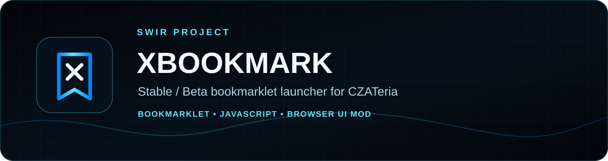
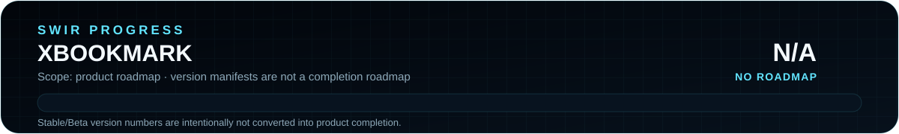
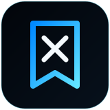

<!-- SWIR-README-STANDARD:v2 -->

 

[**Highlights**](#-highlights) · [**Install**](#-quick-start) · [**Channels**](#-stable--beta-channels) · [**Architecture**](#-loader--version-architecture)

  

**Product roadmap progress:** N/A — XBookmark has version/channel manifests but no canonical checklist or weighted roadmap that supports a truthful product-completion percentage.

## 📍 Project Status

| Item | Status |
|---|---|
| Current stage | Maintained Stable + Beta bookmarklet launcher |
| Target site | CZATeria / `czateria.interia.pl` |
| Launcher | 5.5 |
| Recommended Stable | 10.29 |
| Newest Beta | 10.30 |
| Public GitHub release | None; channels are delivered from repository-pinned scripts |
| Product roadmap | No canonical measurable roadmap |

## 🚀 Overview

**XBookmark** is a browser bookmarklet launcher for **SWIR MOD**, a client-side CZATeria interface modification. It loads a version selector without requiring a browser extension and keeps recent Stable and Beta builds addressable through repository manifests and pinned commit references.

The project is site-specific: it augments the page after the user opens CZATeria and runs the bookmarklet. It does not install a desktop service or system component.

## ✨ Highlights

| Feature | What it does |
|---|---|
| 🔖 Bookmarklet launcher | Starts SWIR MOD directly from a browser bookmark. |
| 🧭 Stable / Beta selector | Lets users choose between the supported Stable and Beta channels. |
| 👥 Friends panel | Maintains local friend identities and room lookup behavior used by current builds. |
| 🧩 Symbol-safe nick handling | Preserves nickname punctuation through current Friends/ACK/snapshot flows. |
| 🔁 Version pinning | Older builds use frozen commit SHA references so later `main` changes do not rewrite them. |
| 🧊 ICE theme layer | Current Beta adds an isolated readability guard for overly bright message text. |
| 🧪 Diagnostics | Newer builds contain ACK/snapshot/route diagnostics used to troubleshoot friend-room detection. |

## ⚙️ Quick Start

### Chrome / Edge / Chromium

1. Open [`bookmark-loader.txt`](bookmark-loader.txt).
2. Copy the entire `javascript:` bookmarklet as one line.
3. Create a new browser bookmark and paste the code into its **URL / Address** field.
4. Open `https://czateria.interia.pl/` and sign in normally.
5. Click the saved bookmark.
6. Choose a Stable or Beta build from the SWIR MOD launcher.

The bookmarklet refuses to run on unrelated hostnames and shows a message instead.

## 📋 Requirements / Compatibility

- A modern Chromium-family browser such as Chrome or Edge.
- Access to the public CZATeria web client.
- JavaScript/bookmarklets allowed by the browser profile.
- Network access to GitHub's API and jsDelivr for the loader path used by the current bookmarklet.

Because XBookmark depends on a third-party website's DOM and client behavior, site changes can break individual features even when the repository itself is unchanged.

## 🧪 Stable / Beta Channels

### Stable 10.29

The current recommended Stable line includes symbol-safe nickname identity, ACK-aware Friends flow, a bounded friend queue, per-connection snapshot merge, per-socket ACK route guarding, the current Friends panel, MIX 8/8 and the ICE theme base.

### Beta 10.30

The current Beta layers an **ICE Readability Guard** over 10.29. It detects near-white message text on light ICE backgrounds and forces a darker readable foreground without intentionally changing nickname colors, Friends logic, ACK routing, snapshots or MIX behavior.

The authoritative channel metadata is stored in [`version.json`](version.json) and [`versions.json`](versions.json).

## 🧠 Loader & Version Architecture

The normal loader flow is:

1. bookmarklet checks the current `main` commit;
2. it loads `swir.js` pinned to that SHA;
3. `swir.js` loads `launcher.js` using the same repository ref;
4. launcher reads the version catalog and lets the user select a build;
5. historical Stable/Beta builds use frozen commit SHA references for reproducibility.

Key files:

| File | Role |
|---|---|
| `bookmark-loader.txt` | Copy/paste bookmarklet source |
| `swir.js` | Lightweight launcher entrypoint |
| `launcher.js` | Stable/Beta selector UI |
| `version.json` | Current channel metadata and pinned refs |
| `versions.json` | Launcher catalog |
| `swir-stable-*.js` | Preserved Stable builds |
| `swir-beta-*.js` | Preserved Beta builds |

## 🗺️ Roadmap

  

XBookmark currently has release-channel/version manifests rather than an authoritative completion roadmap. The project therefore reports product completion as **N/A**, not as a percentage inferred from version numbers or file count.

## 📦 Releases

There are currently **no GitHub Releases** for this repository. Distribution is repository/channel based through the bookmarklet and pinned scripts.

[**Repository history →**](https://github.com/Swir/XBookmark/commits/main)

## ⚠️ Limitations / Responsible Use

- XBookmark modifies only the current browser page context; it is not an official CZATeria product.
- Third-party DOM/protocol changes can require maintenance.
- Beta builds are test builds and may be less stable than the recommended Stable channel.
- The loader executes JavaScript fetched from the XBookmark repository through GitHub/jsDelivr; users should review the source and use only repository-controlled URLs.
- Use the tool in accordance with the target service's terms and applicable rules. This documentation does not claim moderation, privilege escalation, authentication bypass or access-control capabilities.

## 🔎 Search Keywords

`CZATeria bookmarklet` • `SWIR MOD launcher` • `browser chat bookmarklet` • `JavaScript bookmarklet launcher` • `Stable Beta script launcher` • `CZATeria friends panel` • `symbol safe nickname handling` • `browser UI modification` • `jsDelivr GitHub bookmarklet` • `client side chat enhancement` • `XBookmark SWIR`

### `PIN • LAUNCH • TEST • STABILIZE`

⭐ **If this project is useful, consider leaving a star.**

[**← SWIR profile**](https://github.com/Swir) · [**All projects →**](https://github.com/Swir?tab=repositories)

